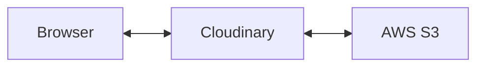

## Introduction

As for all sites, you need a way to serve your images, videos, etc. I heard good things about Cloudinary, so I wanted to try using it for this site. As I was setting it up, I felt the directions for connecting to an AWS S3 media source was a bit confusing, so I wanted to share clearer directions on how to get the connection to work.

Before jumping in, here's a bit of background:

[Cloudinary Media Optimizer](https://cloudinary.com/documentation/media_optimizer) is a service that allows you to transform and optimize media on the fly. It works by setting up a storage location (such as [AWS S3](https://aws.amazon.com/s3/)) and then setting up a connection between your Cloudinary account and that storage location. Cloudinary will then read from that storage location and serve the media to your site.

## Set up

In order to follow this tutorial, you need the following:

- A [Cloudinary](https://cloudinary.com/) account
  - [Pricing note](https://cloudinary.com/pricing)\* - Cloudinary has an excellent free tier
- An [AWS](https://aws.amazon.com/) account
  - [Pricing note](https://aws.amazon.com/s3/pricing/)\* - for basic sites, S3 is basically nothing

We will first go through the AWS setup materials and then move over to Cloudinary to finish the setup. Time to jump in!

## AWS

### Creating the S3 Bucket

We first need to create an S3 Bucket where we will store all of our media.

> Bucket - basically a folder that can be shared publically

If you haven't already, let's navigate over to the AWS Console and search for S3. On the AWS S3 dashboard, we want to create a new `Bucket`. We're going to create one that is not publicly accessible, but we will make sure that our Cloudinary account can access these files.

When creating a new `Bucket`, make sure that the `Block all public access` box is checked and save it.

### Secure Access through IAM

Now that we have the S3 bucket created, we have to create a key that we can give to Cloudinary to be able to access the S3 bucket. This is just like you going to a hardware store to get your house keys copied and then giving those copied keys to your friends, family, or maybe, if you're crazy enough, some random stranger.

Now let's consider actually giving this newly copied house key to this random stranger. It's normal to be cautious about this random stranger we're letting into our house. We don't need to give them full permissions to snoop around however they like. In AWS IAM world, we can create a key so that this random stranger can only get into our kitchen, turn the water on and off in the sink, and open and close the dishwasher (hopefully they are kind enough to do our dishes). For this next part, we are only going to give Cloudinary access to read all the files we place in the newly created S3 bucket.

To do this, we'll have to do two things within AWS IAM:

1. Create a new policy
2. Create a new user that contains above policy

> IAM - Identity Access Management

#### Create a new policy

In the AWS IAM console, select `Policies` and create a new policy. For this new policy form, we need to be specific about the `Service`, `Action` and `Resource`.

1. `Service`

   - search for `AWS S3` and select it.

2. `Actions`

   - expand the `List` access and select `ListBucket`
   - expand the `Read` access and select `GetObject`

3. `Resources`

   - for bucket, select `Add ARN`
     - enter the name of your S3 bucket
     - NOTE\* - it should look like this `arn:aws:s3:::<bucket name>`
   - for object, select `Add ARN`
     - enter the name of your S3 bucket
     - select `Any` for object name
     - NOTE* - the ARN should look like this `arn:aws:s3:::<bucket name>/*`

> ARN - AWS Resource Name. It uniquely identifies resources you create in your AWS account

Your policy form should look like this:

#### Create a new user

Back in the IAM console, go to `Access Management`, select `Users` and let's add a new User. Name it whatever you want and ensure you have the `Access key - Programmatic access` box checked. Hit `Next` to move on to permissions.

For permissions, select `Attach existing policies directly` and add the policy we just created above.

On the final page of creating this new user, AWS will give us the credentials for programmatic access. We will get an

- Access key id
- Secret access key

Download the CSV containing these credentials. We will enter them in the Cloudinary dashboard below.

## Cloudinary

### Media Source

In the Cloudinary dashboard, we will first have to create a `Media Source`. On the top menu, select `Configuration`. And from the side bar, select `Media Sources`. Now, let's add a new one.

Name it whatever you like and select `AWS S3` for the Type. We will now have to enter details related to our S3 bucket and AWS user we created.

This will now show you a few details that you need to add.

1. `Bucket name`

   - enter the name of the S3 bucket you created.

2. `Bucket folder`

   - enter the folder in the bucket that will contain all of your images, videos, etc
   - NOTE\* - you can name this whatever you like, but you will need to make sure this folder exists in your S3 bucket and you are placing all of your media in this folder

3. `Access key`

   - enter in the access key id that can be found in the CSV file we downloaded

4. `Secret key`

   - enter in the secret access key that can be found in the CSV file we downloaded

### Optimization Profile

The last step we need to do is create an `Optimization Profile`. This profile will let set up a URL on a domain (either custom or default), that will connect to a media source, such as an AWS S3 Bucket, and then apply basic transformations on your media.

1. `Media Sources`

   - select the Media Source we just created

2. `Optimization profile URL`

   - enter the path prefix you would like to use in the URL

Name the profile whatever you like, and save it. Cloudinary will ask you if you want to enable this profile, so select `Enable Optimization Profile`.

## Final Words

And now we are done! You can now copy start placing images in your AWS S3 bucket and access them through the Cloudinary optimization profile URL.
